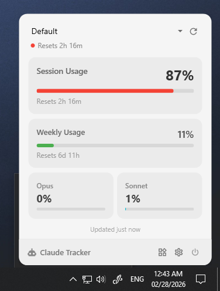
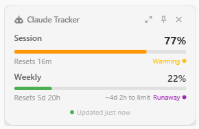

<p align="center">
  <h1 align="center">Claude Tracker</h1>
  <p align="center">Windows system tray app for real-time Claude AI usage monitoring</p>
</p>

<p align="center">
  <a href="https://github.com/TobiiNT/ClaudeTracker/releases/latest"></a>
  <a href="LICENSE"></a>
  
  
</p>

<p align="center">
  
  &nbsp;&nbsp;
  
</p>

### [⬇️ Download Latest Release (v1.2.0)](https://github.com/TobiiNT/ClaudeTracker/releases/latest)
> **Note**: Windows may show a SmartScreen warning on first run. Click "More info" → "Run anyway" — this is expected for unsigned apps.
---

Get instant visibility into your Claude session and weekly usage, overage costs, and receive alerts before hitting rate limits. Windows port of [Claude Usage Tracker](https://github.com/hamed-elfayome/Claude-Usage-Tracker) (macOS).

## Features

- **Real-time usage monitoring** — Session (5-hour) and weekly usage percentages, Opus/Sonnet breakdowns
- **Floating widget** — Always-on-top compact widget with dock/undock, switchable from the popover
- **5 tray icon styles** — Battery, Progress Bar, Percentage, Ring, Compact (Dot)
- **Custom icon colors** — Status-based (green/orange/red), monochrome, or pick any color
- **Multi-profile support** — Manage multiple Claude accounts with isolated credentials
- **Notifications** — Configurable alerts at 75%, 90%, 95% usage thresholds
- **API billing tracking** — Monitor console spend and prepaid credits
- **Claude Code CLI sync** — Automatically reads OAuth tokens from Windows Credential Manager
- **Auto-start sessions** — Detects 0% usage reset and starts a new session automatically
- **Auto-update** — Built-in update system with delta packages via Velopack
- **Global hotkey** — Toggle the dashboard with `Ctrl+Shift+C`
- **Dark/Light theme** — Follows system theme or manual override
- **DPI-aware** — Crisp icons at any display scaling (100%-200%)

## Installation

### Installer (Recommended)

1. Download `Setup.exe` from the [latest release](https://github.com/TobiiNT/ClaudeTracker/releases/latest)
2. Run the installer — it will create a Start Menu shortcut and handle updates automatically
3. Future updates are applied in-app via **Settings > About > Check for Updates**

### Portable

1. Download the `ClaudeTracker-*-portable-win-x64.zip` from [Releases](https://github.com/TobiiNT/ClaudeTracker/releases/latest)
2. Extract to any folder
3. Run `ClaudeTracker.exe`

> **Note:** The portable version does not support auto-updates.

### Build from Source

**Requirements:**
- [.NET 8 SDK](https://dotnet.microsoft.com/download/dotnet/8.0) or later
- Windows 10 (build 19041) or later

```bash
git clone https://github.com/TobiiNT/ClaudeTracker.git
cd ClaudeTracker
dotnet build
dotnet run --project src/ClaudeTracker
```

## Setup

1. Launch Claude Tracker — it appears in the system tray
2. Right-click the tray icon > **Settings**
3. Go to the **Connect** tab
4. Choose one of the authentication methods below

### Authentication Methods

| Method | How to configure |
|--------|-----------------|
| **Claude Code CLI** (easiest) | If you use [Claude Code](https://docs.anthropic.com/en/docs/claude-code), Claude Tracker automatically reads its OAuth token from Windows Credential Manager. No manual setup needed. |
| **Claude.ai session** | In the Connect tab, paste your session token and click **Test Connection**. Select your organization and save. |
| **API Console** | Enter your API console session token to track billing and prepaid credits. |

## Configuration

Settings are stored in `%APPDATA%\ClaudeTracker\settings.json`. Logs are written to `%APPDATA%\ClaudeTracker\logs\`.

| Setting | Default | Description |
|---------|---------|-------------|
| Refresh interval | 60s | How often usage is fetched (10-300s) |
| Icon style | Battery | Tray icon visualization style |
| Theme | System | Auto, Light, or Dark |
| Notifications | Enabled | Alert at 75%, 90%, 95% |
| Launch at login | Off | Start with Windows via Registry |
| Auto-start session | Off | Auto-start when usage resets to 0% |

## Tech Stack

- **.NET 8** / C# / WPF
- [MaterialDesignInXaml](https://github.com/MaterialDesignInXAML/MaterialDesignInXamlToolkit) — Material Design UI
- [Hardcodet.NotifyIcon.Wpf](https://github.com/hardcodet/wpf-notifyicon) — System tray integration
- [SkiaSharp](https://github.com/mono/SkiaSharp) — DPI-aware tray icon rendering
- [CommunityToolkit.Mvvm](https://github.com/CommunityToolkit/dotnet) — MVVM pattern
- [Velopack](https://velopack.io/) — Installer and auto-update
- Microsoft.Extensions.DependencyInjection — DI container

## Project Structure

```
src/ClaudeTracker/
├── Models/          Data models (usage, profiles, settings)
├── Services/        API client, credentials, notifications, updates
├── ViewModels/      MVVM view models
├── Views/           WPF windows and user controls
├── TrayIcon/        Tray icon management and SkiaSharp rendering
├── Utilities/       Constants, validators, formatters
├── Themes/          Shared WPF styles
└── Localization/    Resource strings
```

## Contributing

Contributions are welcome! See [CONTRIBUTING.md](CONTRIBUTING.md) for guidelines.

## Security

To report a vulnerability, please see [SECURITY.md](SECURITY.md).

## Acknowledgments

- [Claude Usage Tracker](https://github.com/hamed-elfayome/Claude-Usage-Tracker) by hamed-elfayome — the original macOS app this project is based on
- Built with help from [Claude Code](https://claude.ai/claude-code)

## License

[MIT](LICENSE)
